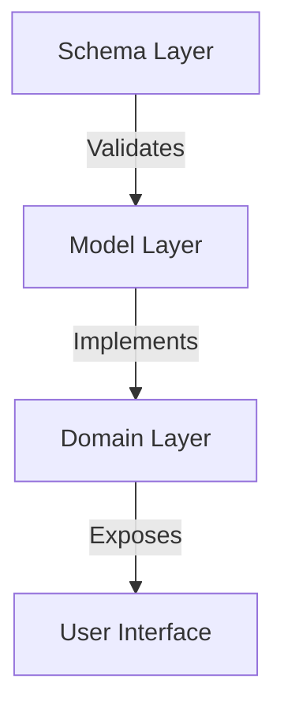
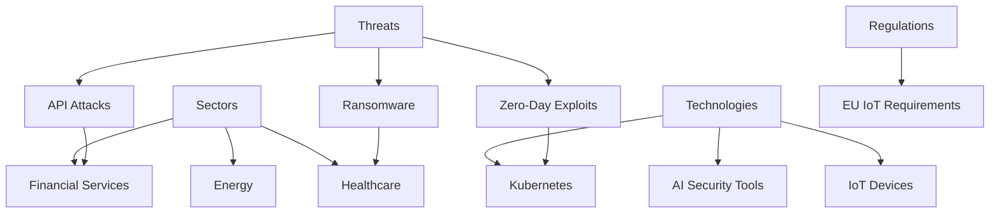

# Building Intelligent Knowledge Systems with MGraph-AI: A Comprehensive Guide

## Introduction

In the evolving landscape of artificial intelligence and knowledge management, organizations face growing challenges in processing, understanding, and utilizing vast amounts of information effectively. This comprehensive guide introduces MGraph-AI, a novel approach to building intelligent knowledge systems that combines the power of graph databases, semantic understanding, and large language models.

### The Challenge

Modern organizations face several critical challenges:

1. **Information Overload**
   - Increasing volume of data sources
   - Multiple content formats and structures
   - Need for real-time processing
   - Complex relationships between information

2. **Knowledge Integration**
   - Connecting related information
   - Maintaining semantic context
   - Preserving relationship intelligence
   - Supporting multiple perspectives

3. **Intelligent Access**
   - Role-appropriate information delivery
   - Context-aware responses
   - Actionable insights
   - Real-time knowledge utilization

### The Solution

This documentation presents a comprehensive solution built on three key innovations:

1. **MGraph-AI: A Serverless Type-Safe Graph Database**
   - Serverless architecture for simplified deployment
   - Strong type safety for reliable operations
   - File-based storage for portability
   - High-performance graph operations

2. **Semantic Knowledge Graph Processing**
   - Dynamic ontology construction
   - Relationship-aware processing
   - Context preservation
   - Intelligent query handling

3. **Role-Aware Knowledge Delivery**
   - Persona-based response generation
   - Context-appropriate detail levels
   - Action-oriented insights
   - Integrated knowledge presentation

### Documentation Structure

This guide is organized into three main sections:

1. **Technical Implementation (Part 1)**
   - Detailed system architecture
   - Component interactions
   - Implementation patterns
   - Performance considerations

2. **Graph RAG Integration (Part 2)**
   - Comparison with traditional approaches
   - Enhanced capabilities
   - Type safety benefits
   - Query optimization

3. **Practical Application (Part 3)**
   - Real-world use cases
   - User interaction patterns
   - Role-based adaptations
   - Implementation examples

### Key Innovations

The system introduces several groundbreaking features:

1. **Type-Safe Graph Operations**
```python
class Schema__MGraph__Node(Type_Safe):
    node_data : Schema__MGraph__Node__Data
    node_id   : Obj_Id
    node_type : Type['Schema__MGraph__Node']
```
- Runtime type validation
- Safe data operations
- Error prevention
- Clear contracts

2. **Semantic Processing**
```python
class SemanticProcessor:
    def extract_semantics(self, content: str) -> List[Dict[str, Any]]:
        # Dynamic semantic extraction
        semantic_data = self.llm_client.analyze(content)
        return self._create_semantic_nodes(semantic_data)
```
- Dynamic understanding
- Context preservation
- Relationship extraction
- Knowledge integration

3. **Role-Aware Response Generation**
```python
class ResponseGenerator:
    def generate_response(self, 
                         query: str,
                         user_role: str,
                         context: Dict[str, Any]) -> str:
        # Role-appropriate response generation
        return self.llm_client.complete(
            self._build_prompt(query, user_role, context)
        )
```
- Persona-based adaptation
- Context-aware details
- Actionable insights
- Relevant focus

### Business Impact

This solution addresses critical business needs:

1. **Improved Decision Making**
   - Role-appropriate information
   - Contextual understanding
   - Connected insights
   - Action-oriented recommendations

2. **Operational Efficiency**
   - Automated processing
   - Quick deployment
   - Low maintenance
   - Scalable operations

3. **Knowledge Utilization**
   - Enhanced accessibility
   - Preserved context
   - Relationship awareness
   - Multi-perspective views

### Getting Started

The following sections provide:
1. Detailed technical implementation
2. Comparison with existing solutions
3. Practical usage examples
4. Best practices and patterns
5. Integration guidance

Whether you're a technical architect designing knowledge systems, a developer implementing intelligent applications, or a business stakeholder evaluating solutions, this guide provides the comprehensive information needed to understand and utilize MGraph-AI effectively.

Let's begin by exploring the technical implementation in detail...

----

# Part 1 - Traditional Graph RAG vs MGraph Implementation: Detailed Comparison

## Traditional Graph RAG Approach

### Property Graph Structure
Traditional Graph RAG systems typically use property graphs like Neo4j or Amazon Neptune, where the focus is on storing entities and relationships in a flexible but less strictly typed manner:

```python
# Typical Graph RAG Node Structure
class GraphNode:
    properties: Dict[str, Any]  # Flexible but untyped
    labels: List[str]          # Generic categorization
    relationships: Dict[str, List['GraphNode']]

# Example Usage
node = GraphNode(
    properties={"title": "AI Research", "date": "2024-01-29"},
    labels=["Article", "Research"],
    relationships={"CITES": [other_node1, other_node2]}
)
```

The traditional approach provides flexibility but sacrifices type safety and structural validation. This can lead to inconsistencies in data representation and requires careful application-level validation.

### Pre-built Ontologies
Traditional systems often rely on existing knowledge bases or pre-defined ontologies:

- Schema.org vocabulary
- Domain-specific ontologies (e.g., SNOMED CT for medical)
- Custom organizational taxonomies

Example ontology integration:
```python
class TraditionalGraphRAG:
    def __init__(self):
        self.ontology = load_ontology("schema.org")
        self.graph_db = GraphDatabase()
    
    def classify_entity(self, entity: str) -> str:
        return self.ontology.get_best_match(entity)
```

This approach can be limiting when dealing with dynamic or evolving domains where the ontology needs to adapt to new information.

## MGraph Implementation

### Type-Safe Graph Structure

Our MGraph implementation enforces strict typing and structural validation through its layered architecture:

```python
class Schema__MGraph__SKG__Node__Data(Type_Safe):
    concept    : str
    type       : str                # Strictly typed classification
    properties : Dict[str, str] = {}
    
class Schema__MGraph__SKG__Node(Schema__MGraph__Node):
    node_data: Schema__MGraph__SKG__Node__Data  # Type-safe composition

# Usage with runtime validation
node = Schema__MGraph__SKG__Node(
    node_data=Schema__MGraph__SKG__Node__Data(
        concept="Machine Learning",
        type="technology",
        properties={"field": "AI", "maturity": "emerging"}
    )
)
```

The MGraph approach provides several advantages:
1. Runtime type validation
2. Structural consistency guarantees
3. Clear data modeling boundaries
4. Self-documenting code structure

### Dynamic Semantic Layer

Instead of relying on pre-built ontologies, our system builds a dynamic semantic layer using LLM-powered analysis:

```python
class SemanticExtractor:
    def extract_semantics(self, content: str) -> List[Dict[str, Any]]:
        prompt = """Analyze the following content and extract:
        1. Key concepts and entities
        2. Relationships between concepts
        3. Properties and attributes
        
        Content: {content}
        
        Return as structured JSON."""
        
        # LLM processes content and identifies semantic structure
        response = self.llm_client.complete(prompt)
        semantic_data = json.loads(response)
        
        # Convert to typed graph nodes
        return [self._create_semantic_node(item) for item in semantic_data]
        
    def _create_semantic_node(self, semantic_data: Dict) -> Schema__MGraph__SKG__Node:
        return Schema__MGraph__SKG__Node(
            node_data=Schema__MGraph__SKG__Node__Data(
                concept=semantic_data['concept'],
                type=semantic_data['type'],
                properties=semantic_data['properties']
            )
        )
```

This dynamic approach allows:
1. Domain-adaptive semantic extraction
2. Emergent ontology development
3. Context-aware relationship building
4. Continuous knowledge evolution

### Hybrid Query Processing

Our system combines structured graph queries with semantic understanding:

```python
class SemanticQueryProcessor:
    def process_query(self, user_query: str) -> Dict[str, Any]:
        # Get current schema context
        schema = self.skg_graph.get_schema()
        
        # Generate structured query plan using LLM
        query_plan = self._generate_query_plan(user_query, schema)
        
        # Execute graph traversal with typing
        results = self._execute_typed_query(query_plan)
        
        return self._generate_response(results, user_query)
        
    def _execute_typed_query(self, query_plan: Dict) -> List[Schema__MGraph__SKG__Node]:
        with self.skg_graph.data() as data:
            index = data.index()
            results = []
            
            # Type-safe graph traversal
            for concept in query_plan['concepts']:
                nodes = index.get_nodes_by_field('concept', concept)
                for node_id in nodes:
                    node = data.node(node_id)
                    if self._matches_criteria(node, query_plan['filters']):
                        results.append(node)
                        
            return results
```

The hybrid approach provides:
1. Type-safe query execution
2. Semantic query planning
3. Efficient graph traversal
4. Context-aware results

### Performance Optimizations

MGraph's indexing system enables efficient querying while maintaining type safety:

```python
class Schema__MGraph__Index__Data(Type_Safe):
    nodes_by_type      : Dict[str, Set[Obj_Id]]           # Fast type lookup
    nodes_by_field     : Dict[str, Dict[Any, Set[Obj_Id]]] # Attribute indexing
    edge_to_nodes      : Dict[Obj_Id, Tuple[Obj_Id, Obj_Id]] # Relationship lookup
    
class MGraph__Index:
    def get_nodes_by_semantic_criteria(self, 
                                     concept: str, 
                                     type: str, 
                                     properties: Dict[str, str]) -> Set[Obj_Id]:
        # Efficient multi-criteria search using indexes
        candidates = self.get_nodes_by_field('concept', concept)
        type_nodes = self.get_nodes_by_field('type', type)
        
        # Set intersection for fast filtering
        results = candidates & type_nodes
        
        # Property filtering
        for key, value in properties.items():
            property_nodes = self.get_nodes_by_field(key, value)
            results &= property_nodes
            
        return results
```

Key performance features:
1. O(1) type lookups
2. Efficient property filtering
3. Fast relationship traversal
4. Optimized set operations

## Integration with LLM Systems

The MGraph implementation provides structured context for LLM interactions:

```python
class SemanticLLMInterface:
    def generate_response(self, 
                         query: str, 
                         graph_results: List[Schema__MGraph__SKG__Node]) -> str:
        # Convert graph nodes to structured context
        context = self._build_context(graph_results)
        
        prompt = f"""Given the following semantic context:
        {json.dumps(context, indent=2)}
        
        And the user query: "{query}"
        
        Generate a response that:
        1. Uses the provided semantic information
        2. Maintains consistency with the graph structure
        3. Provides accurate relationship context
        
        Response:"""
        
        return self.llm_client.complete(prompt)
        
    def _build_context(self, 
                       nodes: List[Schema__MGraph__SKG__Node]) -> Dict[str, Any]:
        # Convert typed nodes to structured context
        return {
            'concepts': [node.node_data.concept for node in nodes],
            'relationships': self._extract_relationships(nodes),
            'properties': self._collect_properties(nodes)
        }
```

This integration approach:
1. Maintains semantic consistency
2. Provides structured context
3. Enables relationship-aware responses
4. Supports traceable information flow

## Conclusion

The MGraph implementation enhances traditional Graph RAG by providing:
1. Type safety throughout the stack
2. Dynamic semantic understanding
3. Efficient querying mechanisms
4. Structured LLM integration
5. Performance optimization

This makes it particularly suitable for applications requiring:
- Data integrity guarantees
- Dynamic domain adaptation
- Efficient information retrieval
- Semantic consistency
- Traceable knowledge representation


---

# Part 2 - MGraph-AI: A Serverless Type-Safe Graph Database

## Core Architecture

MGraph-AI implements a unique three-layer architecture that separates concerns while maintaining strict type safety:

### Layer Structure



1. **Schema Layer**: Pure data structures and validation
   ```python
   class Schema__MGraph__Node(Type_Safe):
       node_data : Schema__MGraph__Node__Data
       node_id   : Obj_Id
       node_type : Type['Schema__MGraph__Node']
   ```

2. **Model Layer**: Direct data operations
   ```python
   class Model__MGraph__Node(Type_Safe):
       data    : Schema__MGraph__Node
       node_id : Obj_Id  # Type-safe property mapping
   ```

3. **Domain Layer**: Business logic and operations
   ```python
   class Domain__MGraph__Node(Type_Safe):
       node : Model__MGraph__Node
       graph: Model__MGraph__Graph
   ```

## Serverless Architecture

MGraph-AI is designed to be completely serverless, operating entirely in-memory with file-based persistence:

### File-Based Storage System

```python
class MGraph__Storage(Type_Safe):
    def save_to_file(self, target_file: str) -> None:
        graph_data = self.graph.json()        # Serialize graph
        return json_file_create(graph_data)    # Save to file

    def load_from_file(self, source_file: str) -> None:
        graph_data = json_load_file(source_file)    # Load serialized data
        self.graph = Graph.from_json(graph_data)    # Reconstruct graph
```

Key features:
1. No database server required
2. Portable data files
3. Simple file-based persistence
4. JSON serialization for interoperability

### In-Memory Processing

The graph operates entirely in memory:
```python
class MGraph(Type_Safe):
    graph: Domain__MGraph__Graph    # In-memory graph structure
    
    def edit(self) -> MGraph__Edit:
        return MGraph__Edit(graph=self.graph)  # Direct memory operations
```

Benefits:
- Fast operation execution
- No network latency
- Simple deployment
- Easy testing and development

## Type Safety System

MGraph-AI uses a sophisticated type safety system built on the `Type_Safe` base class:

### Type_Safe Foundation

```python
class Type_Safe:
    """Base class providing runtime type checking and validation"""
    
    def __init__(self, **kwargs):
        self._validate_types(kwargs)    # Check types at initialization
        self._set_attributes(kwargs)    # Set validated attributes

    def _validate_types(self, values: Dict[str, Any]) -> None:
        annotations = self.__annotations__
        for name, expected_type in annotations.items():
            if name in values:
                self._check_type(name, values[name], expected_type)
```

Features:
1. Runtime type validation
2. Attribute type enforcement
3. Safe serialization
4. Type-safe collections

### Type-Safe Operations

All graph operations maintain type safety:

```python
def add_node(self, node: Schema__MGraph__Node) -> Model__MGraph__Node:
    """Add node with type validation"""
    if not isinstance(node, self.schema_types.node_type):
        raise TypeError(f"Expected {self.schema_types.node_type}, got {type(node)}")
    
    self.data.nodes[node.node_id] = node
    return self.model_types.node_model_type(data=node)
```

Benefits:
- Catch errors early
- Maintain data consistency
- Self-documenting code
- Clear contracts

## File-Based Data Store

MGraph-AI uses a sophisticated file-based storage system that maintains both performance and data integrity:

### Storage Format

```python
{
    "nodes": {
        "node_id_1": {
            "node_data": {
                "name": "example",
                "value": "data"
            },
            "node_type": "Schema__MGraph__Node"
        }
    },
    "edges": {
        "edge_id_1": {
            "from_node_id": "node_id_1",
            "to_node_id": "node_id_2",
            "edge_type": "Schema__MGraph__Edge"
        }
    }
}
```

### Index System

MGraph-AI maintains performant operations through a sophisticated indexing system:

```python
class Schema__MGraph__Index__Data(Type_Safe):
    nodes_to_outgoing_edges: Dict[Obj_Id, Set[Obj_Id]]           # Fast edge lookup
    nodes_to_incoming_edges: Dict[Obj_Id, Set[Obj_Id]]           # Reverse lookup
    nodes_by_type         : Dict[str   , Set[Obj_Id]]           # Type-based access
    nodes_by_attribute    : Dict[str   , Dict[Any, Set[Obj_Id]]] # Property lookup
```

Features:
1. O(1) node lookup
2. Efficient edge traversal
3. Quick attribute filtering
4. Type-based querying

## Provider System

MGraph-AI supports different data formats through its provider system:

### Provider Architecture

```python
class MGraph__Json(MGraph):
    """JSON document provider"""
    def __init__(self):
        super().__init__()
        self.graph.model.data.schema_types.node_type = Schema__MGraph__Json__Node

class MGraph__RSS(MGraph):
    """RSS feed provider"""
    def __init__(self):
        super().__init__()
        self.graph.model.data.schema_types.node_type = Schema__MGraph__RSS__Node
```

Supported formats:
- JSON
- XML/RSS
- CSV
- GraphML
- Custom formats

## Usage Patterns

### Context Manager Support

MGraph-AI provides safe resource management through context managers:

```python
with graph.edit() as edit:
    # Create new nodes
    node1 = edit.new_node(value="example")
    node2 = edit.new_node(value="test")
    
    # Create edge between nodes
    edge = edit.new_edge(from_node_id=node1.node_id,
                        to_node_id=node2.node_id)
```

Benefits:
- Automatic resource cleanup
- Transaction-like semantics
- Safe error handling
- Clear scope boundaries

### Query Operations

Efficient query operations through the index system:

```python
with graph.data() as data:
    # Get index for efficient querying
    index = data.index()
    
    # Find nodes by type
    value_nodes = index.get_nodes_by_type(Schema__MGraph__Node__Value)
    
    # Find nodes by property
    active_nodes = index.get_nodes_by_field('status', 'active')
```

## Key Features

### 1. Serverless Operation
- No database installation
- File-based persistence
- Portable data files
- Simple deployment

### 2. Type Safety
- Runtime type checking
- Data validation
- Safe serialization
- Type-safe operations

### 3. Performance
- In-memory processing
- Efficient indexing
- Quick traversal
- Optimized operations

### 4. Flexibility
- Provider system
- Custom data types
- Extensible architecture
- Format support

### 5. Developer Experience
- Clear error messages
- Self-documenting code
- Safe operations
- Context managers

## Use Cases

### 1. Embedded Applications
- Desktop applications
- CLI tools
- Testing environments
- Development tools

### 2. Serverless Applications
- AWS Lambda functions
- Azure Functions
- Google Cloud Functions
- Edge computing

### 3. Data Processing
- ETL operations
- Data transformation
- Format conversion
- Graph analysis

### 4. Content Management
- Document storage
- Content relationships
- Metadata management
- Version control

## Comparison with Traditional Graph Databases

| Feature | MGraph-AI | Traditional Graph DB |
|---------|-----------|---------------------|
| Deployment | Serverless | Server required |
| Type Safety | Built-in | Optional/None |
| Storage | File-based | Database files |
| Performance | In-memory | Client-server |
| Setup | No installation | Server setup |
| Portability | High | Limited |

## Conclusion

MGraph-AI represents a unique approach to graph databases, combining:
1. Serverless operation
2. Strong type safety
3. File-based persistence
4. High performance
5. Developer-friendly features

This makes it particularly suitable for:
- Serverless applications
- Edge computing
- Embedded systems
- Development tools
- Data processing pipelines

The combination of type safety and serverless operation provides a powerful tool for building reliable, portable graph-based applications without the overhead of traditional database systems.


----

# Part 3 -  MGraph Security News Analysis: User Perspective

## Sample Security News Feed

### RSS Feed Content

```json
{
    "feed": {
        "title": "Cyber Security News Feed",
        "items": [
            {
                "title": "Major Cloud Provider Reports Zero-Day Vulnerability in Kubernetes",
                "pubDate": "2024-01-29",
                "content": "A critical zero-day vulnerability in Kubernetes container orchestration system could allow attackers to escape pod restrictions and gain access to host systems. The vulnerability affects all versions prior to 1.28.3. Cloud providers are rolling out emergency patches.",
                "categories": ["Cloud Security", "Kubernetes", "Zero-Day", "Container Security"]
            },
            {
                "title": "Ransomware Group Targets Healthcare Providers With New Tactics",
                "pubDate": "2024-01-28",
                "content": "A sophisticated ransomware group has been observed using new social engineering tactics to breach healthcare organizations. The group, known as PharmaLock, combines phishing attacks with exploits in legacy medical device software.",
                "categories": ["Ransomware", "Healthcare", "Social Engineering", "Phishing"]
            },
            {
                "title": "EU Announces New Cybersecurity Regulations for IoT Devices",
                "pubDate": "2024-01-27",
                "content": "The European Union has announced new cybersecurity requirements for IoT devices sold in the EU market. Manufacturers will need to implement specific security measures and maintain regular security updates for at least 5 years.",
                "categories": ["Compliance", "IoT Security", "Regulations", "EU"]
            },
            {
                "title": "AI-Powered Security Tool Detects Novel Malware Strains",
                "pubDate": "2024-01-26",
                "content": "A new security tool using advanced machine learning algorithms has demonstrated success in detecting previously unknown malware variants. The system achieved a 95% detection rate in independent testing.",
                "categories": ["Artificial Intelligence", "Malware Detection", "Security Tools"]
            },
            {
                "title": "Critical Infrastructure Attack Attempted in Energy Sector",
                "pubDate": "2024-01-25",
                "content": "Security researchers have uncovered a sophisticated attempt to breach energy sector control systems. The attack used custom malware targeting industrial control systems (ICS) and showed signs of state-sponsored activity.",
                "categories": ["Critical Infrastructure", "Energy Sector", "ICS Security", "State-Sponsored Attacks"]
            },
            {
                "title": "Global Financial Services Face Wave of API Attacks",
                "pubDate": "2024-01-24",
                "content": "Financial institutions worldwide are experiencing an increase in sophisticated API-based attacks. Attackers are exploiting authentication vulnerabilities to access sensitive financial data and initiate fraudulent transactions.",
                "categories": ["Financial Security", "API Security", "Authentication", "Fraud"]
            }
        ]
    }
}
```

## Semantic Knowledge Graph Construction

### Extracted Concepts and Relationships



### Ontology Structure

```python
{
    "entities": {
        "threats": ["ransomware", "zero-day", "api_attacks", "malware"],
        "sectors": ["healthcare", "financial", "energy", "critical_infrastructure"],
        "technologies": ["kubernetes", "iot", "ai", "ics"],
        "regulations": ["eu_requirements", "compliance_standards"]
    },
    "relationships": {
        "affects": "indicates which sector/technology is impacted",
        "mitigates": "shows protective measures",
        "requires": "indicates regulatory requirements",
        "threatens": "shows attack vectors"
    },
    "properties": {
        "severity": ["critical", "high", "medium", "low"],
        "status": ["active", "contained", "potential"],
        "timeframe": ["immediate", "short_term", "long_term"]
    }
}
```

## User Interaction Examples

### Board Member Persona

#### Query: "What are the most significant cyber risks we need to be aware of this month?"

```python
# LLM Processing Context
context = {
    "user_role": "Board Member",
    "perspective": "Strategic",
    "focus_areas": ["Business Impact", "Risk Level", "Regulatory Compliance"]
}

# Graph Query Plan
query_plan = {
    "priority_filters": ["severity: critical", "business_impact: high"],
    "categorization": "sector_based",
    "timeframe": "current_month"
}
```

#### Generated Response:

"Based on recent security developments, there are three key areas requiring board attention:

1. **Critical Infrastructure Risk**
   - Sophisticated state-sponsored attacks targeting energy sector
   - Potential business impact: Operational disruption and regulatory scrutiny
   - Recommended focus: Review critical infrastructure protection measures

2. **Regulatory Compliance**
   - New EU IoT security requirements affecting product lines
   - Business impact: Product development and compliance costs
   - Action needed: Assess product portfolio against new requirements

3. **Financial Services Security**
   - Widespread API-based attacks on financial institutions
   - Business impact: Potential fraud and reputational risk
   - Consideration: Review security measures for financial operations

These issues warrant discussion in the next board meeting, particularly regarding resource allocation for compliance and security improvements."

### CISO Persona

#### Query: "What immediate security actions should we prioritize based on recent threats?"

```python
# LLM Processing Context
context = {
    "user_role": "CISO",
    "perspective": "Technical",
    "focus_areas": ["Technical Details", "Mitigation Steps", "Security Controls"]
}

# Graph Query Plan
query_plan = {
    "priority_filters": ["status: active", "mitigation: required"],
    "categorization": "threat_based",
    "timeframe": "immediate"
}
```

#### Generated Response:

"Based on current threat intelligence, here are priority actions needed:

1. **Kubernetes Infrastructure**
   - CRITICAL: Deploy emergency patches for zero-day vulnerability
   - Affected versions: All prior to 1.28.3
   - Action items:
     * Inventory all Kubernetes clusters
     * Implement container escape prevention measures
     * Review pod security policies
   - Timeline: Immediate patching required

2. **Healthcare Systems Protection**
   - URGENT: Address PharmaLock ransomware campaign
   - Technical details:
     * New social engineering tactics observed
     * Targeting legacy medical device software
   - Required actions:
     * Update phishing detection rules
     * Patch medical device software
     * Enhance monitoring for lateral movement

3. **API Security Enhancement**
   - HIGH PRIORITY: Address authentication vulnerabilities
   - Focus areas:
     * Authentication mechanism review
     * API access logging enhancement
     * Transaction monitoring improvements
   - Implementation timeline: Next 48 hours

4. **Additional Technical Controls**
   - Deploy AI-based malware detection (95% effectiveness reported)
   - Review ICS network segmentation
   - Update IoT security standards for EU compliance

Recommend immediate security team briefing to coordinate response efforts."

## System Processing Flow

### 1. Content Ingestion
```python
# RSS content is processed into typed nodes
rss_processor = MGraph__RSS()
rss_processor.load_rss_json(security_news)

# Semantic extraction occurs
semantic_processor = SemanticRSSProcessor(llm_client)
semantic_processor.process_feed(rss_content)
```

### 2. Knowledge Graph Construction
```python
# Concepts are extracted and linked
semantic_graph = MGraph__SKG()
semantic_graph.add_concept(
    concept="Ransomware",
    type="threat",
    properties={
        "severity": "critical",
        "status": "active",
        "affected_sector": "healthcare"
    }
)
```

### 3. Query Processing
```python
# User query is processed with role context
def process_user_query(query: str, user_role: str) -> str:
    context = get_role_context(user_role)
    relevant_nodes = semantic_graph.query(
        query,
        context=context,
        priority_filters=context['focus_areas']
    )
    return generate_response(relevant_nodes, context)
```

## Role-Based Response Adaptation

### Board Member Focus
- Strategic risk assessment
- Business impact analysis
- Regulatory compliance
- Resource allocation
- Long-term planning

### CISO Focus
- Technical vulnerability details
- Immediate mitigation steps
- Security control implementation
- Team coordination
- Technical resource deployment

## Benefits of This Approach

1. **Contextual Understanding**
   - Role-appropriate information delivery
   - Relevant detail level
   - Focused recommendations

2. **Knowledge Integration**
   - Connected threat intelligence
   - Related impact analysis
   - Cross-domain insights

3. **Action Orientation**
   - Clear next steps
   - Prioritized responses
   - Resource guidance

4. **Temporal Awareness**
   - Immediate threats
   - Emerging risks
   - Long-term trends

## Conclusion

This example demonstrates how MGraph-AI can:
1. Process security news into structured knowledge
2. Maintain relationship context
3. Adapt responses to user roles
4. Provide actionable insights
5. Support decision-making at different organizational levels